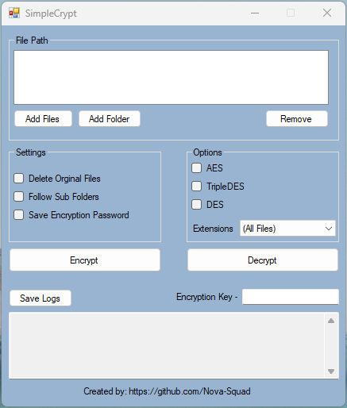

# SimpleCrypt

SimpleCrypt is a versatile encryption tool designed to provide a user-friendly experience while ensuring robust data security. This software supports various encryption algorithms, including AES, 3DES, and DES, offering flexibility and reliability for safeguarding your sensitive information.

## Key Features

- **AES, 3DES, DES Encryption:** SimpleCrypt supports three widely recognized encryption algorithms, ensuring strong data protection.

- **Save Logs:** Keep track of your encryption activities with savable logs, providing an audit trail for future reference or troubleshooting.

## Supported File Types

Exclude specific file types during encryption to streamline your workflow. SimpleCrypt supports the following file extension categories:

- **Audio:** mp3, wav, acc, ogg, amr, wma
- **Code:** cs, vb, java, py, rb, cpp, html, css, js
- **Compressed:** zip, rar, 7z, tar, gzip
- **Documents:** pdf, txt, rtf, doc, docx, ppt, pptx, xls, xlsx
- **Images:** jpg, jpeg, png, gif, bmp
- **Videos:** avi, flv, mov, mp4, mpg, rm, rmvb, mkv, swf, vob, wmv, 3g2, 3gp, asf, ogv

